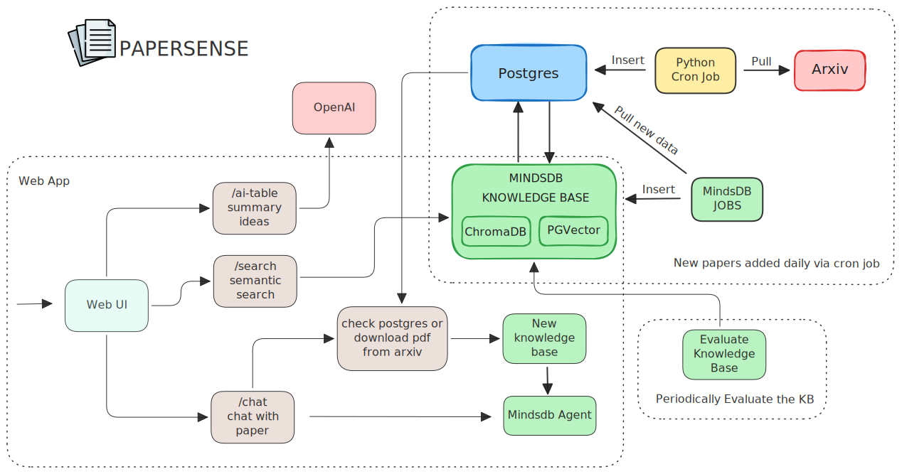

<h1>
  
  Papersense
</h1>
*Search smarter, Discover deeper.*

---

## 🚀 Overview

**PaperSense** is an intelligent semantic search engine for arXiv papers. Instead of relying on keyword or summary matches, PaperSense uses cutting-edge embeddings and neural search to help you find the most relevant academic papers—based on *meaning*, not just text.

Whether you're a researcher, student, or curious mind, PaperSense helps you explore the arXiv like never before.

- Demo Video - Check out Papersense in action on [Youtube](https://www.youtube.com/watch?v=_Aw-lg2cKbA)
- DevTo Article - My experience building Papersense [DevTo](https://dev.to/better-boy/papersense-semantic-arxiv-search-chat-built-with-mindsdb-1kfi)

---

## 🔍 Features

- 🔎 **Semantic Search**: Understands the context of your queries using large language models and vector embeddings.
- 🧬 **Supports Natural Language Queries**: Ask questions like *"papers on diffusion models in climate forecasting"*.
- 📚 **Real-Time arXiv Data**: Keeps your search results current with arXiv's latest updates.
- 🌐 **Clean Web UI**: Intuitive interface to search, explore, and read abstracts.
- 📈 **Ranking by Relevance**: Results ranked by semantic closeness—not just keyword count.
- 🧠 **Paper-Specific Chatbot**: Powered by MindsDB AI agents, enabling intelligent, context-aware conversations with individual research papers.
- 🗃️ **Support for multiple vector bases**: This app has support for chromaDB and pgVector. Enable them at the config file.
- 📝 **AI based paper summary**: Summarize lengthly papers to a few words
- 🪄 **AI based idea generation**: Generate futuristic ideas derived from a research paper
- **Periodic Evaluation**: Periodic evaluations are run to check the accuracy of the semantic search engine
---

## 🛠️ Tech Stack

- **Frontend**: Javascript
- **Backend**: Python (FastAPI)
- **Embeddings**: OpenAI
- **Search Engine**: MindsDB & ChromaDB
- **Data Source**: [arXiv API](https://arxiv.org/help/api)
- **Python Linter** : [ruff](https://docs.astral.sh/ruff/)

---
## High Level Architecture



|      Papersense feature           | Powered by MindsDB feature  |
| --------------------------------- | --------------------------- |
| Semantic Search                   | Knowledge bases             |
| PDF Chatbot                       | Agents + Knowledge bases    |
| AI summarizer                     | AI tables                   |
| AI generate ideas                 | AI tables                   |
| Periodic Evaluation               | JOBS + EVALUATE command     |
| Cron based uploading new papers   | JOBS                        |
| Fast search queries               | CREATE INDEX command        |


## ⚙️ Installation

**Before running the application, go over the configuration settings once**

There are 2 ways to install.

#### Manual Installation

1. Clone the repository

```bash
git clone https://github.com/Better-Boy/PaperSense
cd papersense
```

2. Install the required packages

```bash
pip install -r requirements.txt
```

4. This project needs an active postgres database running. In order to update the postgres related config like host, port etc. refer to the [YAML Config Settings](/assests/yaml_config.md)

5. Manually, create a new database with name - `arxiv_psql_db` or the one you mention in the config - `postgres.database`. If you want to give a different database name, then don't forget to update the field `postgres.database` in the yaml file.

5. Set your API keys as an environment variable

```bash
export OPENAI_API_KEY=your_key_here
```

Then run the server:

```bash
python webapp.py
```

#### Docker Installation

```bash
git clone https://github.com/Better-Boy/PaperSense
cd papersense
export OPENAI_API_KEY=your_key_here
docker-compose up --build
```

#### Configuration Settings

Refer [YAML Config Settings](/assests/yaml_config.md)

These settings are important for running and testing the app.

## 💡 Example Query

> “Recent breakthroughs in graph neural networks for molecular property prediction”

➡️ **PaperSense** returns the most relevant papers—even if those exact words don’t appear—because it understands your query semantically.

## Best practices followed

- Modular code
- Logging
- Config driven
- Benchmark and Stress testing
- Detailed documentation in README
- [ruff](https://github.com/astral-sh/ruff) linting and formatting
- Benchmark and stress testing using locust

## Testing

For detailed instructions on benchmark testing refer [Benchmark](/reports/benchmark.md)  
For detailed instructions on stress testing refer [Stress](/reports/stress.md)

## Quest Checklist

Refer [checklist](assests/checklist.md)

---

### 🙏 Acknowledgments

```markdown
- [arXiv.org](https://arxiv.org/)
- [OpenAI](https://openai.com/)
- [MindsDB](https://mindsdb.com/)
```
