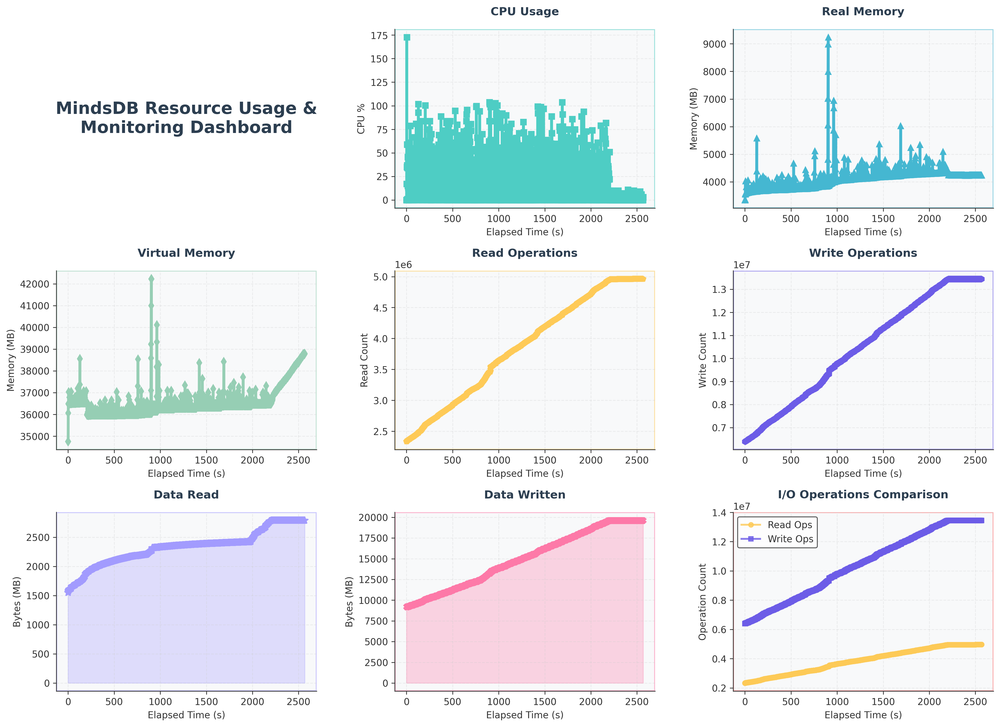

# MindsDB Knowledge Base Benchmark Report

**Generated on:** 2025-07-01 09:43:17  
**Total Test Duration:** 2580.56 seconds  
**Report Type:** Knowledge Base API Performance Analysis

---

## Executive Summary

### 📊 Key Performance Indicators

| Metric | Value | Status |
|--------|-------|--------|
| **Total Requests** | 1,026 | ✅ |
| **Success Rate** | 99.8% | ✅ |
| **Successful Requests** | 1,024 | - |
| **Failed Requests** | 2 | ⚠️ |
| **Average Response Time** | 2.515s | ⚠️ |

### 🎯 Overall Assessment

**🔴 POOR** - Significant performance issues detected. Immediate optimization required.

### 🔍 Quick Insights

- **Fastest Knowledge Base Operation:** create (0.007s avg)
- **Slowest Knowledge Base Operation:** delete (18.915s avg)
- **Most Reliable:** create (100.0% success rate)

- **Row count in Knowledge Base:** 1

### 📋 Test Configuration

- **Test Period:** 2025-07-01 09:00:30.824329 to 2025-07-01 09:43:14.911306
- **Knowledge Base Functionalities tested:** create, insert, search, delete
- **Test Methodology:** Sequential execution (setup → insert → search → delete)

---
## Test Environment

### Software Specs
- **OS**: Linux-6.6.87.2-microsoft-standard-WSL2-x86_64-with-glibc2.39
- **Python Version**: 3.12.11
- **MindsDB Version**: 25.6.3.1
- **Knowledge Base Embedding Model**: text-embedding-3-small
- **Knowledge Base ReRanking Model**: gpt-4o
- **Knowledge Base Storage**: ChromaDB
### Hardware Specs
- **Machine**: x86_64
- **Processor**: x86_64
- **CPU Cores**: 32
- **RAM (GB)**: 15.15
- **Disk Total (GB)**: 1006.85

---
## Detailed Analysis

### 🔧 Create Operation

**Performance Status:** 🟢 EXCELLENT

#### 📈 Core Metrics

| Metric | Value |
|--------|-------|
| Total Requests | 1 |
| Successful Requests | 1 |
| Success Rate | 100.00% |
| Average Response Time | 0.007s |
| Median Response Time | 0.007s |
| Minimum Response Time | 0.007s |
| Maximum Response Time | 0.007s |
| Standard Deviation | 0.000s |
| 95th Percentile | 0.007s |
| 99th Percentile | 0.007s |

#### 🎯 Performance Analysis

- **Response Time:** ✅ Excellent - Very fast response times
- **Consistency:** ✅ Very consistent performance
- **Tail Latency:** ✅ Good - 95th percentile within expected range

---

### 🔧 Insert Operation

**Performance Status:** 🟡 GOOD

#### 📈 Core Metrics

| Metric | Value |
|--------|-------|
| Total Requests | 999 |
| Successful Requests | 997 |
| Success Rate | 99.80% |
| Average Response Time | 2.208s |
| Median Response Time | 2.026s |
| Minimum Response Time | 0.787s |
| Maximum Response Time | 15.564s |
| Standard Deviation | 0.994s |
| 95th Percentile | 3.595s |
| 99th Percentile | 5.411s |

#### 🎯 Performance Analysis

- **Response Time:** ❌ Poor - Very slow response times
- **Consistency:** ⚠️ Moderately consistent performance
- **Tail Latency:** ✅ Good - 95th percentile within expected range

#### ⚠️ Error Analysis

| Status Code | Count | Description |
|-------------|-------|-------------|
| 200 | 2 | Unknown Error |

**Sample Error Messages:**

1. `{"type": "error", "error_code": 0, "error_message": "The SQL statement cannot be parsed - INSERT INT...`
2. `{"type": "error", "error_code": 0, "error_message": "The SQL statement cannot be parsed - INSERT INT...`

#### 💡 Specific Recommendations

- ⚠️ insert has 99.8% success rate. Investigate error causes and improve reliability.
- ⏰ insert response time (2.21s) could be improved. Consider adding database indexes or optimizing business logic.
- 💾 Consider implementing batch insert operations to improve throughput.

---

### 🔧 Search Operation

**Performance Status:** 🟢 EXCELLENT

#### 📈 Core Metrics

| Metric | Value |
|--------|-------|
| Total Requests | 25 |
| Successful Requests | 25 |
| Success Rate | 100.00% |
| Average Response Time | 14.389s |
| Median Response Time | 16.329s |
| Minimum Response Time | 2.018s |
| Maximum Response Time | 19.385s |
| Standard Deviation | 4.959s |
| 95th Percentile | 18.727s |
| 99th Percentile | 19.272s |

#### 🎯 Performance Analysis

- **Response Time:** ❌ Poor - Very slow response times
- **Consistency:** ⚠️ Moderately consistent performance
- **Tail Latency:** ✅ Good - 95th percentile within expected range

#### 💡 Specific Recommendations

- 🐌 search has high average response time (14.39s). Consider optimizing database queries, adding caching, or scaling resources.
- 🔍 Search performance could benefit from better indexing or search optimization.

---

### 🔧 Delete Operation

**Performance Status:** 🟢 EXCELLENT

#### 📈 Core Metrics

| Metric | Value |
|--------|-------|
| Total Requests | 1 |
| Successful Requests | 1 |
| Success Rate | 100.00% |
| Average Response Time | 18.915s |
| Median Response Time | 18.915s |
| Minimum Response Time | 18.915s |
| Maximum Response Time | 18.915s |
| Standard Deviation | 0.000s |
| 95th Percentile | 18.915s |
| 99th Percentile | 18.915s |

#### 🎯 Performance Analysis

- **Response Time:** ❌ Poor - Very slow response times
- **Consistency:** ✅ Very consistent performance
- **Tail Latency:** ✅ Good - 95th percentile within expected range

#### 💡 Specific Recommendations

- 🐌 delete has high average response time (18.91s). Consider optimizing database queries, adding caching, or scaling resources.

---

## Resource usage analysis
#### Key Metrics
            
- **Max memory usage**: 9,235.36 MB

- **Average memory usage (MB)**: 4,072.97 MB

- **Max CPU usage (%)**: 172.60

- **Average CPU usage (%)**: 19.12

Resource usage graph:

            ---

## 💡 Optimization Recommendations

### 🚀 Priority Actions

#### 🟡 Medium Priority

1. ⚠️ insert has 99.8% success rate. Investigate error causes and improve reliability.
2. ⏰ insert response time (2.21s) could be improved. Consider adding database indexes or optimizing business logic.
3. 🐌 search has high average response time (14.39s). Consider optimizing database queries, adding caching, or scaling resources.
4. 🐌 delete has high average response time (18.91s). Consider optimizing database queries, adding caching, or scaling resources.

#### 🟢 Low Priority

1. 💾 Consider implementing batch insert operations to improve throughput.
2. 🔍 Search performance could benefit from better indexing or search optimization.
3. 🔧 Implement monitoring and alerting for these performance metrics in production.

---

## 📊 Technical Appendix

### Methodology

This benchmark follows a sequential testing approach:
1. **Setup Phase:** Initialize knowledge base
2. **Insert Phase:** Add records to the knowledge base
3. **Search Phase:** Query the knowledge base
4. **Cleanup Phase:** Delete the knowledge base

In order to run the benchmarking script, refer `benchmark.md` file found in the `reports` folder of the repo https://github.com/Better-Boy/PaperSense.

### Metrics Definitions

- **Response Time:** Time from request initiation to response completion
- **Success Rate:** Percentage of requests returning 2xx HTTP status codes
- **P95/P99:** 95th and 99th percentile response times (tail latency)
- **Standard Deviation:** Measure of response time variability
- **Throughput:** Requests processed per unit time

### Performance Thresholds

- **Excellent:** < 100ms average response time, > 99% success rate
- **Good:** < 500ms average response time, > 95% success rate  
- **Fair:** < 1000ms average response time, > 90% success rate
- **Poor:** > 1000ms average response time or < 90% success rate

---

*Report generated by API Benchmark Tool*
