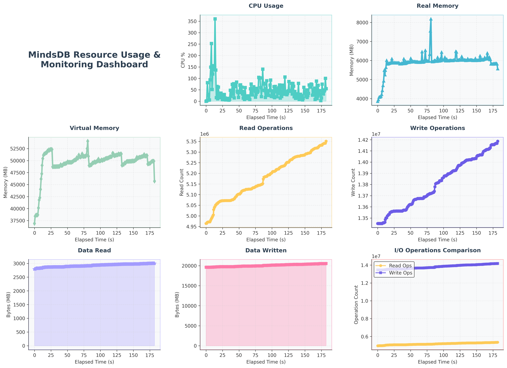

# MindsDB Knowledge Base Stress Test Report

## Test Configuration
- **Test Date**: 2025-07-01 09:48:45
- **Test Duration**: 177.18 seconds
- **Data Size**: 1,000 records (research papers)
- **Concurrent Users**: 15
- **Spawn Rate**: 2 users/second
- **Wait Time**: between 1s and 5s
- **Target Host**: http://127.0.0.1:47334
- **Total Data Volume**: 89.07 MB

## Test Environment
### Software Specs
- **OS**: Linux-6.6.87.2-microsoft-standard-WSL2-x86_64-with-glibc2.39
- **Python Version**: 3.12.11
- **MindsDB Version**: 25.6.3.1
- **Knowledge Base Embedding Model**: text-embedding-3-small
- **Knowledge Base ReRanking Model**: gpt-4o
- **Knowledge Base Storage**: ChromaDB
### Hardware Specs
- **Machine**: x86_64
- **Processor**: x86_64
- **CPU Cores**: 32
- **RAM (GB)**: 15.15
- **Disk Total (GB)**: 1006.85

## Executive Summary

### Overall Performance
- **Total Requests**: 213
- **Total Failures**: 0
- **Overall Success Rate**: 100.00%
- **Average Response Time**: 9105.80ms
- **Overall RPS**: 1.20 requests/second
- **Knowledge Base Creation Time**: 4.18s
- **Knowledge Base Deletion Time**: 4.18s
- **Knowledge Base Row Count**: 1
- **Total Data Volume**: 89.07 MB

### Ingestion Performance
- **Total Records (Papers) Processed**: 131
- **Success Rate**: 100.00%
- **Average Response Time**: 2747.02ms
- **Throughput (Records per Second)**: 0.74

### Search Performance  
- **Total Search Queries**: 82
- **Success Rate**: 100.00%
- **Average Response Time**: 19264.34ms
- **Queries per Second**: 0.46

## Detailed Performance Metrics

### Ingestion Endpoint Analysis

#### Key Metrics
- **Total Requests**: 131
- **Failed Requests**: 0
- **Average Response Time**: 2747.02ms
- **Minimum Response Time**: 1220.09ms
- **Maximum Response Time**: 8388.32ms
- **Requests per Second**: 0.74
- **Median Response Time**: 2300.00ms

#### Response Time Percentiles
- **50th Percentile**: 2300.00ms
- **95th Percentile**: 5200.00ms
- **99th Percentile**: 6900.00ms

### Search Endpoint Analysis

#### Key Metrics
- **Total Requests**: 82
- **Failed Requests**: 0
- **Average Response Time**: 19264.34ms
- **Minimum Response Time**: 3311.94ms
- **Maximum Response Time**: 25255.35ms
- **Requests per Second**: 0.46
- **Median Response Time**: 19000.00ms

#### Response Time Percentiles
- **50th Percentile**: 19000.00ms
- **95th Percentile**: 23000.00ms
- **99th Percentile**: 25000.00ms

### MindsDB Process Resource Usage
#### Key Metrics

- **Max memory usage**: 8,186.27 MB

- **Average memory usage (MB)**: 5,907.52 MB

- **Max CPU usage (%)**: 360.20

- **Average CPU usage (%)**: 47.46

Resource usage graph:

## Response Time Distribution

### Ingestion Response Times

| Metric | Value |
|--------|-------|
| Average | 2747.02ms |
| Median | 2300.00ms |
| 95th Percentile | 5200.00ms |
| 99th Percentile | 6900.00ms |
| Min | 1220.09ms |
| Max | 8388.32ms |

### Search Response Times

| Metric | Value |
|--------|-------|
| Average | 19264.34ms |
| Median | 19000.00ms |
| 95th Percentile | 23000.00ms |
| 99th Percentile | 25000.00ms |
| Min | 3311.94ms |
| Max | 25255.35ms |

## Performance Recommendations

### Ingestion Optimization
- **Critical**: Average response time is very high (>2s). Consider batching the input records
- Implement asynchronous processing

### Search Optimization
- **Performance**: Slow search detected
- Add database indexes on frequently searched fields
- Consider implementing search result caching

## System Resource Implications

### Capacity Analysis
- **Ingestion Capacity**: ~1 records/second
- **Peak Ingestion Rate**: ~44 records/minute
- **Search Capacity**: ~0 queries/second
- **Peak Search Rate**: ~28 queries/minute

### Scaling Recommendations
- **Excellent**: System handled load very well, ready for production scaling
- Consider testing with higher concurrent user loads
- Consider horizontal scaling due to high response times

## Test Validity and Limitations
- Test executed under controlled conditions with 15 concurrent users
- Results may vary with different data patterns and real-world usage scenarios
- Network latency simulated through HTTP requests
- Knowledge Base performance depends on hardware configuration and system resources
- Test data consists of research papers which may not represent all use cases

## Conclusion
The Stress test revealed acceptable performance with some areas for improvement. The system achieved a 100.00% success rate with an average response time of 9105.80ms.

**Key Findings:**
- System handled the majority of requests successfully
- Some performance degradation under peak load
- Response times occasionally exceeded optimal thresholds

**Recommendation:** Implement the suggested optimizations before scaling to higher loads in production.

## Testing Process and Methodology

This test adheres to a standardized methodology to ensure consistent and reproducible results.
In order to run the stress script, refer `stress.md` file found in the `reports` folder of the repo https://github.com/Better-Boy/PaperSense.

---
*Report generated on 2025-07-01 09:51:43*  
*Test Generated By: Big-Bounty*