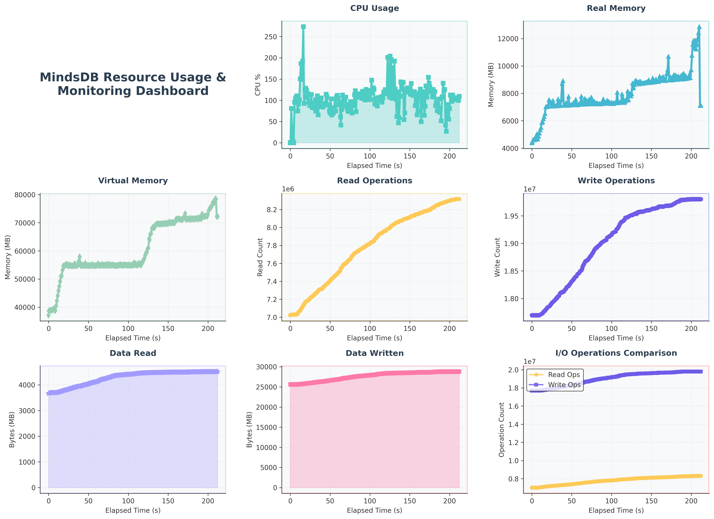

# MindsDB Knowledge Base Stress Test Report

## Test Configuration
- **Test Date**: 2025-07-01 10:11:39
- **Test Duration**: 177.26 seconds
- **Data Size**: 1,000 records (research papers)
- **Concurrent Users**: 100
- **Spawn Rate**: 4 users/second
- **Wait Time**: between 1s and 5s
- **Target Host**: http://127.0.0.1:47334
- **Total Data Volume**: 89.07 MB

## Test Environment
### Software Specs
- **OS**: Linux-6.6.87.2-microsoft-standard-WSL2-x86_64-with-glibc2.39
- **Python Version**: 3.12.11
- **MindsDB Version**: 25.6.3.1
- **Knowledge Base Embedding Model**: text-embedding-3-small
- **Knowledge Base ReRanking Model**: None
- **Knowledge Base Storage**: ChromaDB
### Hardware Specs
- **Machine**: x86_64
- **Processor**: x86_64
- **CPU Cores**: 32
- **RAM (GB)**: 15.15
- **Disk Total (GB)**: 1006.85

## Executive Summary

### Overall Performance
- **Total Requests**: 596
- **Total Failures**: 225
- **Overall Success Rate**: 62.25%
- **Average Response Time**: 23628.77ms
- **Overall RPS**: 3.36 requests/second
- **Knowledge Base Creation Time**: 4.22s
- **Knowledge Base Deletion Time**: 4.22s
- **Knowledge Base Row Count**: 0
- **Total Data Volume**: 89.07 MB

### Ingestion Performance
- **Total Records (Papers) Processed**: 355
- **Success Rate**: 45.92%
- **Average Response Time**: 25059.99ms
- **Throughput (Records per Second)**: 2.00

### Search Performance  
- **Total Search Queries**: 241
- **Success Rate**: 86.31%
- **Average Response Time**: 21520.53ms
- **Queries per Second**: 1.36

## Detailed Performance Metrics

### Ingestion Endpoint Analysis

#### Key Metrics
- **Total Requests**: 355
- **Failed Requests**: 192
- **Average Response Time**: 25059.99ms
- **Minimum Response Time**: 5665.65ms
- **Maximum Response Time**: 30004.77ms
- **Requests per Second**: 2.00
- **Median Response Time**: 27000.00ms

#### Response Time Percentiles
- **50th Percentile**: 27000.00ms
- **95th Percentile**: 30000.00ms
- **99th Percentile**: 30000.00ms

### Search Endpoint Analysis

#### Key Metrics
- **Total Requests**: 241
- **Failed Requests**: 33
- **Average Response Time**: 21520.53ms
- **Minimum Response Time**: 5476.99ms
- **Maximum Response Time**: 30004.22ms
- **Requests per Second**: 1.36
- **Median Response Time**: 22000.00ms

#### Response Time Percentiles
- **50th Percentile**: 22000.00ms
- **95th Percentile**: 30000.00ms
- **99th Percentile**: 30000.00ms

### MindsDB Process Resource Usage
#### Key Metrics

- **Max memory usage**: 12,865.98 MB

- **Average memory usage (MB)**: 7,973.91 MB

- **Max CPU usage (%)**: 273.30

- **Average CPU usage (%)**: 103.23

Resource usage graph:

## Response Time Distribution

### Ingestion Response Times

| Metric | Value |
|--------|-------|
| Average | 25059.99ms |
| Median | 27000.00ms |
| 95th Percentile | 30000.00ms |
| 99th Percentile | 30000.00ms |
| Min | 5665.65ms |
| Max | 30004.77ms |

### Search Response Times

| Metric | Value |
|--------|-------|
| Average | 21520.53ms |
| Median | 22000.00ms |
| 95th Percentile | 30000.00ms |
| 99th Percentile | 30000.00ms |
| Min | 5476.99ms |
| Max | 30004.22ms |

## Performance Recommendations

### Ingestion Optimization
- **Critical**: Average response time is very high (>2s). Consider batching the input records
- Implement asynchronous processing
- **Critical**: High failure rate (54.1%). Implement retry logic and error handling

### Search Optimization
- **Performance**: Slow search detected
- Add database indexes on frequently searched fields
- Consider implementing search result caching
- **Reliability**: High failure rates detected
- Review knowledge base search and reranking strategies

## System Resource Implications

### Capacity Analysis
- **Ingestion Capacity**: ~2 records/second
- **Peak Ingestion Rate**: ~120 records/minute
- **Search Capacity**: ~1 queries/second
- **Peak Search Rate**: ~82 queries/minute

### Scaling Recommendations
- **Critical**: Significant performance issues detected
- Address performance bottlenecks before production deployment
- Consider horizontal scaling due to high response times

## Test Validity and Limitations
- Test executed under controlled conditions with 100 concurrent users
- Results may vary with different data patterns and real-world usage scenarios
- Network latency simulated through HTTP requests
- Knowledge Base performance depends on hardware configuration and system resources
- Test data consists of research papers which may not represent all use cases

## Conclusion
The Stress test identified significant performance challenges. The system achieved only a 62.25% success rate with an average response time of 23628.77ms.

**Key Findings:**
- High failure rates indicate system stress under current load
- Response times exceeded acceptable thresholds
- Multiple performance bottlenecks detected

**Recommendation:** Immediate optimization is required before production deployment. Focus on the critical issues identified in the recommendations sections.

## Testing Process and Methodology

This test adheres to a standardized methodology to ensure consistent and reproducible results.
In order to run the stress script, refer `stress.md` file found in the `reports` folder of the repo https://github.com/Better-Boy/PaperSense.

---
*Report generated on 2025-07-01 10:15:08*  
*Test Generated By: Big-Bounty*