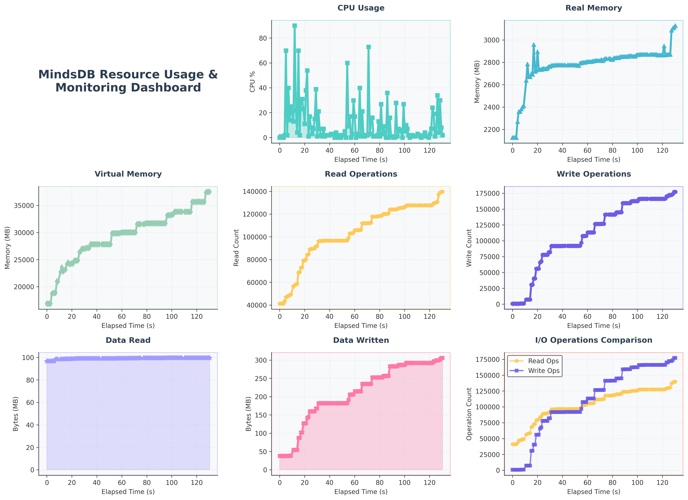

# MindsDB Knowledge Base Benchmark Test Report

## Test Configuration
- **Test Date**: 2025-06-30 08:18:25
- **Test Duration**: 124.09 seconds
- **Data Size**: 1,000 records (research papers)
- **Concurrent Users**: 3
- **Spawn Rate**: 1 users/second
- **Wait time**: between 1s and 5s
- **Target Host**: http://127.0.0.1:47334

## Test Environment
### Software Specs
- **OS**: Linux-6.6.87.2-microsoft-standard-WSL2-x86_64-with-glibc2.39
- **Python Version**: 3.12.11
- **MindsDB Version**: 25.6.3.1
- **Knowledge Base Embedding Model**: text-embedding-3-small
- **Knowledge Base ReRanking Model**: gpt-4o
- **Knowledge Base Storage**: ChromaDB
### Hardware Specs
- **Machine**: x86_64
- **Processor**: x86_64
- **CPU Cores**: 32
- **RAM (GB)**: 15.15
- **Disk Total (GB)**: 1006.85


## Executive Summary

### Overall Performance
- **Total Requests**: 38
- **Total Failures**: 0
- **Overall Success Rate**: 100.00%
- **Average Response Time**: 6224.48ms
- **Overall RPS**: 0.31 requests/second
- **Knowledge Base creation time**: 3.5467708110809326s
- **Knowledge Base deletion time**: 0.03635215759277344s
- **Knowledge Base row count**: 1
- **Total size of text data inserted**: 89.14092254638672 MB

### Ingestion Performance
- **Total Records (Papers) Processed**: 22
- **Success Rate**: 100.00%
- **Average Response Time**: 2020.34ms
- **Throughput (Records per Second)**: 0.18


### Search Performance
- **Total Search Queries**: 16
- **Success Rate**: 100.00%
- **Average Response Time**: 12005.16ms
- **Queries per Second**: 0.13

## Detailed Performance Metrics

### Ingestion Endpoint Analysis

#### Key Metrics
- **Total Requests**: 22
- **Failed Requests**: 0
- **Average Response Time**: 2020.34ms
- **Minimum Response Time**: 1329.81ms
- **Maximum Response Time**: 3210.00ms
- **Requests per Second**: 0.18
- **Median Response Time**: 1900.00ms

#### Response Time Percentiles
- **50th Percentile**: 2000.00ms
- **95th Percentile**: 3200.00ms
- **99th Percentile**: 3200.00ms


### Search Endpoint Analysis

#### Key Metrics
- **Total Requests**: 16
- **Failed Requests**: 0
- **Average Response Time**: 12005.16ms
- **Minimum Response Time**: 462.69ms
- **Maximum Response Time**: 20618.58ms
- **Requests per Second**: 0.13
- **Median Response Time**: 17000.00ms

#### Response Time Percentiles
- **50th Percentile**: 18000.00ms
- **95th Percentile**: 21000.00ms
- **99th Percentile**: 21000.00ms


### MindsDB process resource usage

#### Key Metrics

- **Max memory usage**: 3,127.99 MB
- **Average memory usage (MB)**: 2,779.98 MB
- **Max CPU usage (%)**: 89.90 MB
- **Average CPU usage (%)**: 10.90 MB

Resource usage graph:




## Response Time Distribution

### Ingestion Response Times

| Metric | Value |
|--------|-------|
| Average | 2020.34ms |
| Median | 1900.00ms |
| 95th Percentile | 3200.00ms |
| 99th Percentile | 3200.00ms |
| Min | 1329.81ms |
| Max | 3210.00ms |


### Search Response Times

| Metric | Value |
|--------|-------|
| Average | 12005.16ms |
| Median | 17000.00ms |
| 95th Percentile | 21000.00ms |
| 99th Percentile | 21000.00ms |
| Min | 462.69ms |
| Max | 20618.58ms |


## Error Analysis

### Error Summary
- **Total Errors**: 0
- **Status**: All requests completed successfully


#### Ingestion Error Examples
- No Ingestion errors recorded

#### Search Error Examples
- No search errors recorded

## Performance Recommendations

### Ingestion Optimization
- **Critical**: Average response time is very high (>2s). Consider batching the input records
- Implement asynchronous processing

### Search Optimization
- **Performance**: Slow search detected
- Add database indexes on frequently searched fields
- Consider implementing search result caching

## System Resource Implications

### Capacity Analysis
- **Ingestion Capacity**: ~0 records/second
- **Peak Ingestion Rate**: ~11 records/minute
- **Search Capacity**: ~0 queries/second
- **Peak Search Rate**: ~8 queries/minute

### Scaling Recommendations
- **Excellent**: System handled load very well, ready for production scaling
- Consider testing with higher concurrent user loads
- Consider horizontal scaling due to high response times

## Test Validity and Limitations
- Test executed under controlled conditions with 3 concurrent users
- Results may vary with different data patterns and real-world usage
- Network latency simulated through HTTP requests
- Knowledge Base performance depends on hardware and configuration

## Conclusion
The benchmark test revealed acceptable performance with some areas for improvement. The system achieved a 100.00% success rate with an average response time of 6224.48ms.

**Key Findings:**
- System handled the majority of requests successfully
- Some performance degradation under peak load
- Response times occasionally exceeded optimal thresholds

**Recommendation:** Implement the suggested optimizations before scaling to higher loads in production.

## Testing Process and Methodology

This  test adheres to a standardized methodology to ensure consistent and reproducible results.

### Executing the Test Script: A How-To

1. Install the required libraries (If not installed already):

```bash
pip install seaborn
pip install matplotlib
pip install pandas
pip install locust
pip install gevent
pip install psutil
pip install numpy
pip install psrecord
```
2. The name and schema of the knowledge base is constant. The sql query used to create the knowledge base is as follows:

```sql
CREATE KNOWLEDGE_BASE IF NOT EXISTS arxiv_test_kb
USING
embedding_model = {
"provider": "openai",
"model_name": "text-embedding-3-small",
"api_key": "<openai_api_key>"
},
reranking_model = {
"provider": "openai", 
"model_name": "gpt-4o",
"api_key": "<openai_api_key>"
},
content_columns = ['text'],
metadata_columns = ['authors', 'title', 'categories', 'arxiv_id'];
```
The knowledge is created before starting the test and cleaned up afterwards.

3. Test data generation:

Since I built semantic search using arxiv, I used the papers downloaded itself as the input to the knowledge base. A sample data file is in the `data` folder.
Link to the sample file - [sample_test_data.json](../data/data.json)

The sample file contains clean and processed data of 500 papers.

4. The test script - `benchmark_stress.py` is main running script which uses locust to load test the API endpoints. 
5. The insertion and search functionalities are tested by building respective queries and hitting the `/api/sql/query` endpoint
6. On running the test script, a subprocess is spawned which monitors the resource usage of mindsdb process during test duration. 
7. The subprocess will be terminated after successful completion of load test.
8. Running the script

**Imp**

Before running the script, find the pid (process id) of mindsdb process. MindsDB spawns multiple subprocess, it's important to find the main mindsdb process.

You can get the pid of the mindsdb process by running - `ps -ef | grep mindsdb`. But you need to find the main (or parent) process.

Running the script:

```bash
python benchmark_stress.py --data-file-path ../data/test_data.json --search-query-file-path ../data/queries.json --data-size 400 --host http://127.0.0.1:47334 --users 3 --spawn-rate 1  --run-time 10 --mdb-pid 98970
```

The command line arguments are as follows:

```bash
Knowledge base Test

options:
-h, --help            show this help message and exit
--data-file-path DATA_FILE_PATH
Path to the json data file to be ingested to KB
--search-query-file-path SEARCH_QUERY_FILE_PATH
Path to the json search queries file to be searched on KB
--data-size DATA_SIZE
Total amount of data to process
--host HOST           MindsDB server host
--port PORT           MindsDB server port
--users USERS         Number of concurrent users
--spawn-rate SPAWN_RATE
Users spawned per second
--run-time RUN_TIME   Test duration. Unit is in seconds
--mdb-pid MDB_PID     Mindsdb server pid
```

MindsDB pid has to be given in order to run the test script.

9. Once the test is complete, 3 files are created - 
1. `performance_dashboard.png` - An image file that shows the mindsdb process resource usage
2. `stress_test_report_<timestamp>.md` - The stress test report
3. `benchmark_test_report_<timestamp>.md` - The benchmark test report
4. `activity.csv` - The resource utilization numbers of the mindsdb process collected during the test.


---
*Report generated on 2025-06-30 08:20:31*
*Test configuration: 1000 data size, 3 users*
